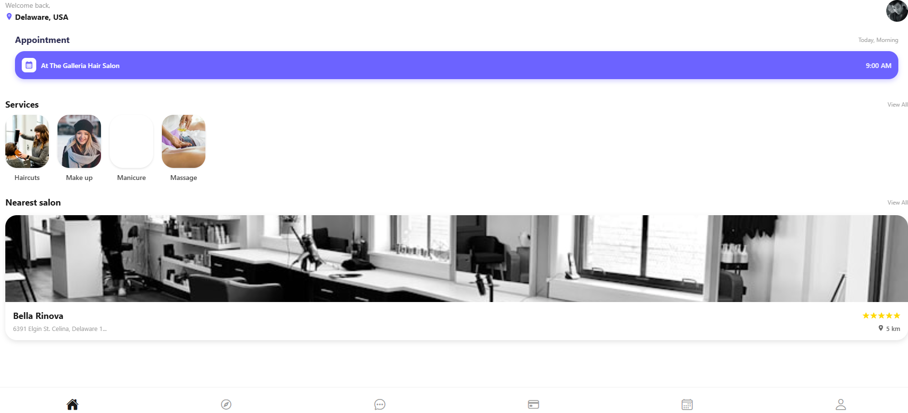

# SalonEase-

SalonEase is a modern, high-performance mobile application designed to bridge the gap between beauty salons and customers. It simplifies the booking process, manages schedules, and provides a seamless payment experience.

# Features
For Customers (Mobile App)
Salon Browsing: Search for salons by name, category, or location.

Smart Booking: Real-time availability for hair cuts, massages, and beauty treatments.

Payment History: Track all past and pending transactions with receipt details.

Favorites: Save your preferred barbers and salons for quick access.

Invite Friends: Integrated contact sharing with referral rewards.

For Salon Owners (Web Dashboard - Upcoming)
Inventory & Service Management: Add or edit services and pricing.

Schedule Control: Define working hours and manage staff availability.

Revenue Reports: Track daily and weekly earnings.

# Tech Stack
Framework: React Native with Expo SDK 54

Navigation: Expo Router (File-based routing)

Icons: Lucide (Feather), Ionicons, and Material Community Icons

State Management: React Hooks (useState, useEffect)

Styling: StyleSheet API (Flexbox)

📂 Project Structure
Plaintext
app/
├── (tabs)/              # Main navigation tabs
├── payment/
│   ├── payment-history.tsx  # Transaction list
│   └── payment-methods.tsx  # Card management
├── edit-profile.tsx     # Profile editing screen
├── invite-friends.tsx   # Contacts & referral screen
├── _layout.tsx          # Main stack provider
└── index.tsx            # Welcome/Login screen
⚙️ Getting Started
Prerequisites
Node.js (v18 or newer)

npm or yarn

Expo Go app on your physical device (for testing)

Installation
Clone the repository

Bash
git clone https://github.com/yourusername/salon-ease.git
cd salon-ease
Install dependencies

Bash
npm install
Install specific Expo modules

Bash
npx expo install expo-contacts expo-router react-native-safe-area-context
Start the development server

Bash
npx expo start
 # Images  
 Image when the user finish to signup to the account